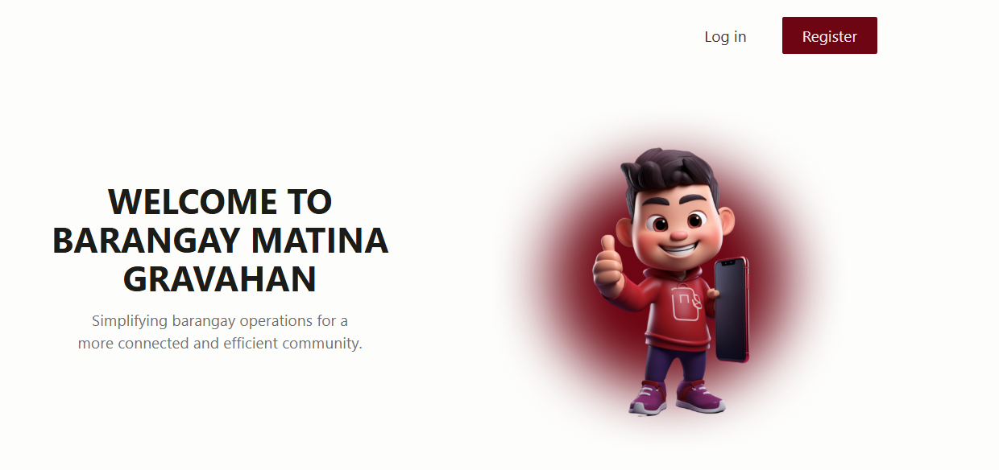
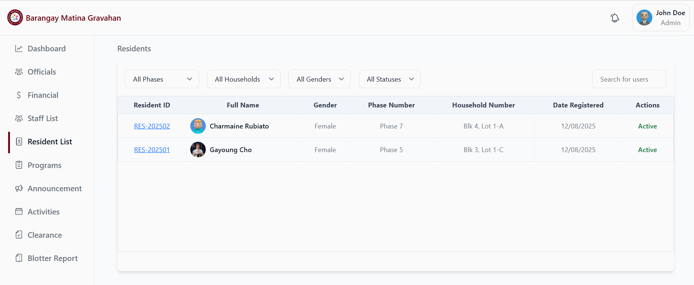
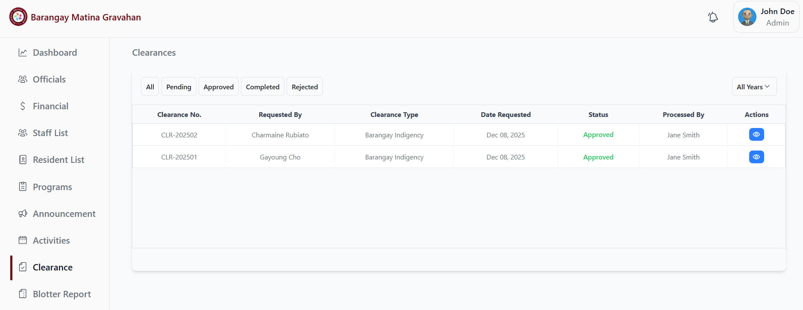
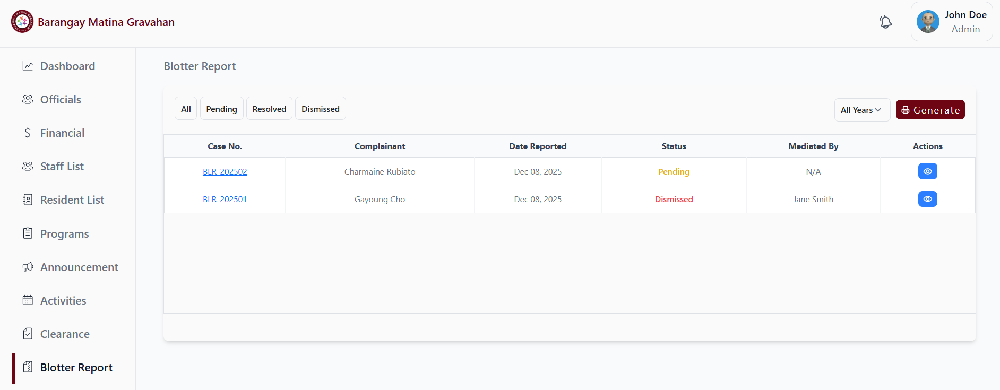
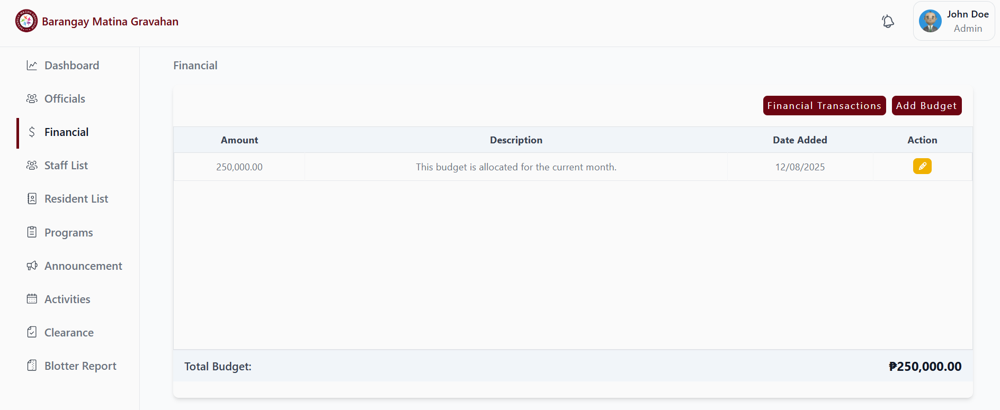
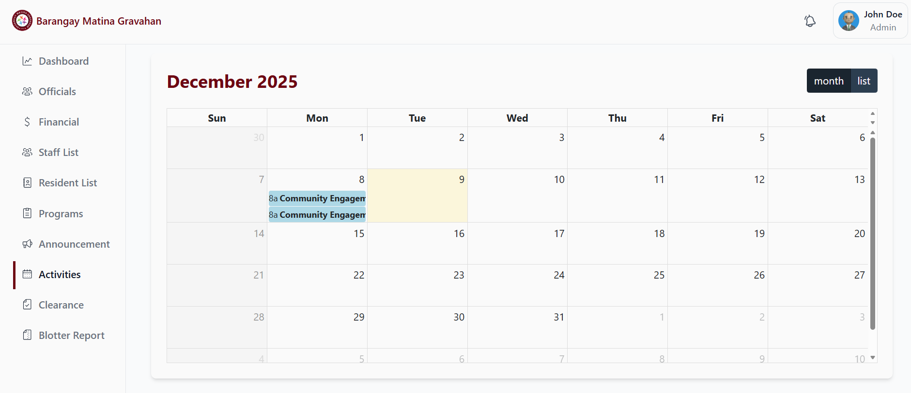
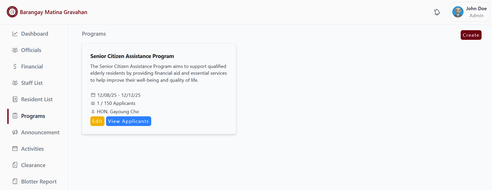
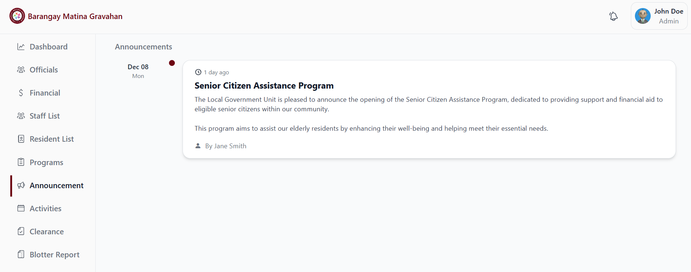

# 👩🏻‍💻 Barangay Management System



<h3>
The Barangay Management System provides a digital platform where residents can request documents, view barangay updates, access programs and services. It was developed to promote transparency, improve service delivery, and strengthen communication between the barangay and its residents.
</h3>

### **Live demo:** 🌐 https://barangay-gravahan.onrender.com/

# Barangay Management System Key Features

### **Resident Management** 🧑🏻



### **Clearance Issuance** 📄



### **Blotter Report** 🗄️



### **Financial Management** 💸



### **Calendar Activities** 🗓️



### **Programs and Announcement** 📥




# How to Clone and Set Up Barangay Management System from GitHub 😊

## Step 1: Clone the repository

Open your terminal and run:

```bash
git clone https://github.com/chrmn6/bms.git
```

This will download the project files to your local machine.

## Step 2: Navigate into the project directory

```bash
cd bms
```

## Step 3: Install PHP dependencies and node using Composer

Make sure you have Composer and NodeJs installed, then run.

```bash
composer install
npm install
npm run dev -- for development
npm run build -- for production
```

## Step 4: Copy the .env file

Create a copy of the .env.example file and rename it to .env

```bash
cp .env.example .env
```

## Step 5: Generate the application key

Run the following Artisan command to generate the app key:

```bash
php artisan key:generate
```

## Step 6: Configure your .env file

Open .env in a text editor, set up your database credentials

```bash
DB_CONNECTION=mysql
DB_HOST=127.0.0.1
DB_PORT=3306
DB_DATABASE=db_bms
DB_USERNAME=root
DB_PASSWORD=
```

## Step 7: Run database migration + seeder

To create the tables and seed the default data, run:

```bash
php artisan migrate --seed
```

## Step 8: Serve the application

Run the built-in Laravel server:

```bash
php artisan serve
```

You should see output the same as below:

```bash
http://127.0.0.1:8000
```

After that, open your browser and navigate to the link to see the Barangay Management System in action.

# Viola!!!🥳🎉 Barangay Management System is running in your local machine! 😊👍🏻
